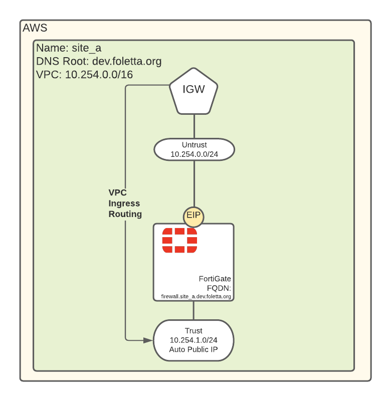

# Topology



# Configuraton

```json
{
    "variable": {
        "sites": {
            "default": {
                "site_a" : {
                    "dns_root": "dev.example.org",
                    "vpc_cidr": "10.254.0.0/16",
                    "networks": {
                        "public": {
                            "untrust": [ 8, 0 ]
                        },
                        "private": {
                            "trust": {
                                "subnet": [ 8, 1 ],
                                "public_ipv4": true
                            }
                        }
                    },
                    "devices": [
                        {
                            "hostname": "firewall",
                            "type": "fgt",
                            "license_file": "licenses/FGVM02TMxxxxxxxx.lic",
                            "fortios:": "6.2.3", 
                            "instance_type": "c5d.large",
                            "interfaces": {
                                "external": { "subnet": "untrust" },
                                "internal": { "subnet": "trust"}
                            }
                        }
                    ]
                }
            }
        }
    }
}
```
